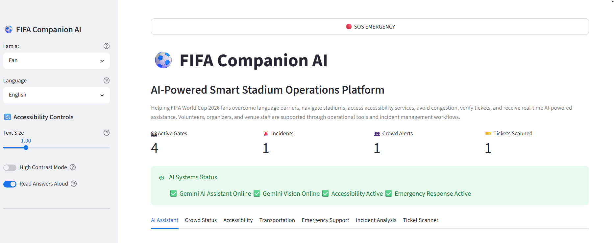
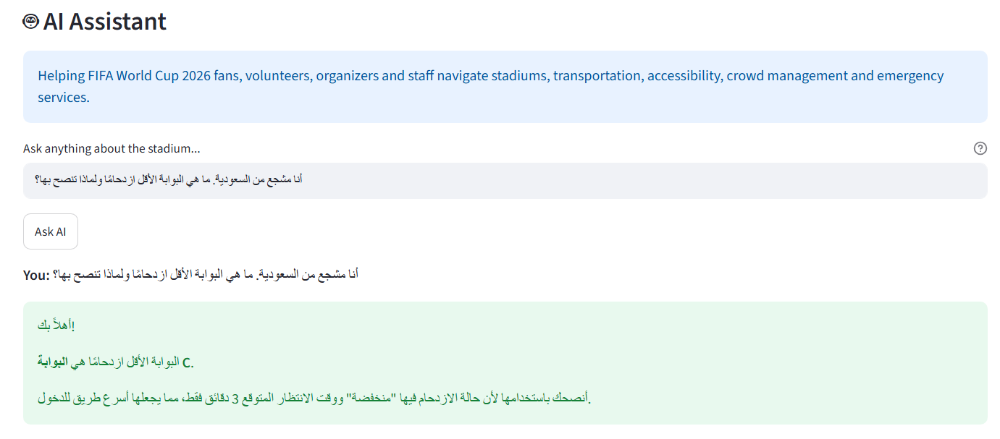
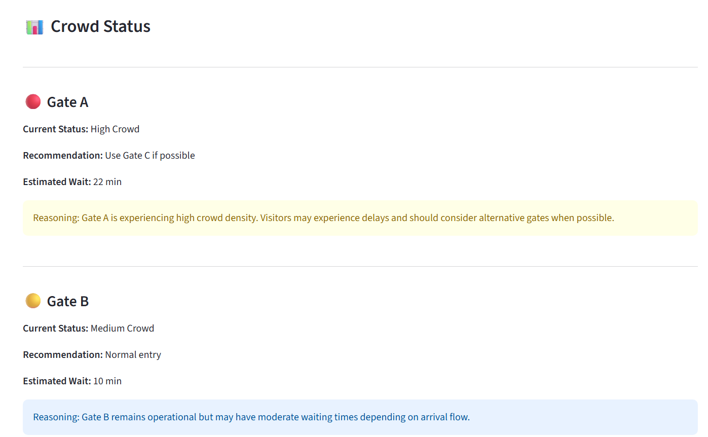
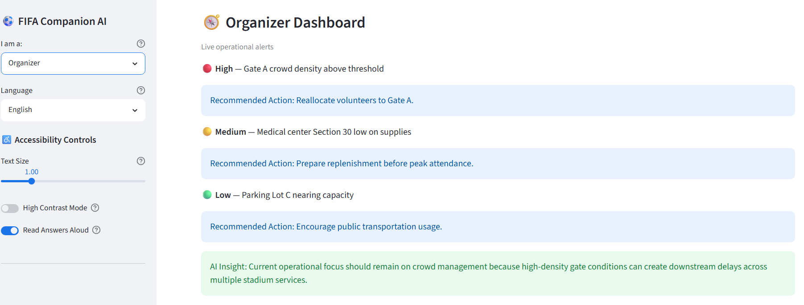
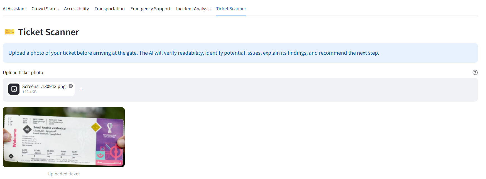
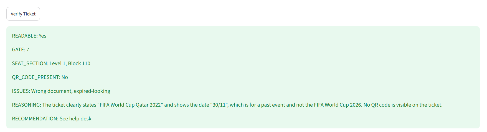
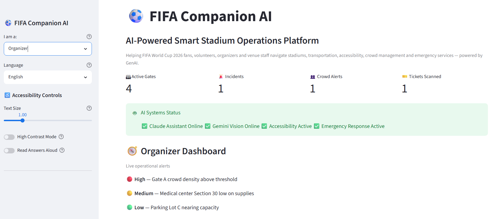
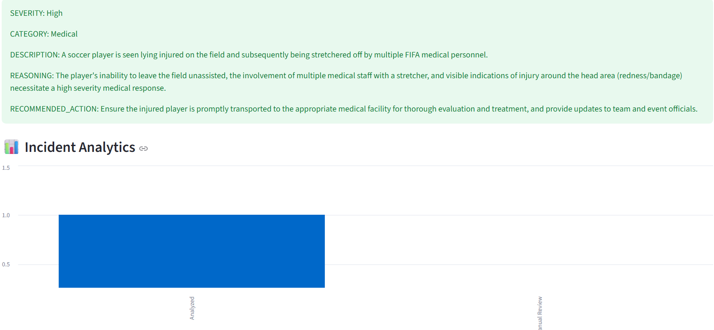

# FIFA World Cup 2026 — Smart Stadium Assistant (v3)

**Hack2Skill PromptWars Challenge 4** — A multimodal GenAI solution for stadium
operations and fan experience during FIFA World Cup 2026.

🌐 **Live App:**  
https://fifa-companion-ai-8i6hmmcrcxkbymgzjcsshh.streamlit.app/

💻 **GitHub Repository:**  
https://github.com/jyothirmayejoguparthi-lgtm/fifa-companion-ai

---

This README is structured around the six evaluation categories so reviewers
(human or automated) can verify each claim directly against the code.

---

## 1. Problem Statement Alignment

The challenge asks for a GenAI-enabled solution serving **fans, organizers,
volunteers, and venue staff** across stadium navigation, transportation,
accessibility, crowd management, and emergency services. This solution
addresses every named persona and every named domain, plus two multimodal
workflows the brief implies but doesn't spell out — visual incident
reporting and ticket verification — which are the parts of a real stadium
deployment that pure text chat cannot cover:

| Brief requirement | Implementation |
|---|---|
| Fans | AI Assistant, Crowd Status, Accessibility, Transportation, Emergency, Ticket Scanner |
| Volunteers | Above + assigned task list + incident photo reporting |
| Organizers | Above + live operational alerts, wait-time metrics, incident audit log |
| Venue Staff | Above + shift roster, internal emergency hotline, incident audit log |
| Crowd management | `modules/crowd_status.py` — gate-by-gate live status + organizer analytics |
| Emergency services | `modules/emergency.py` + `modules/incident_analysis.py` (photo-based triage) |

## Fan Persona Focus

While the platform supports Fans, Volunteers, Organizers, and Venue Staff, the primary focus is the FIFA fan experience.

A common challenge during international sporting events is language barriers and information overload. Fans often need assistance with:

- Finding the least crowded gate
- Navigating the stadium
- Accessing accessibility services
- Locating transportation options
- Receiving emergency guidance
- Understanding ticket issues

The AI Assistant automatically detects the language of the user's query and responds in the same language. Responses are designed to be explainable, helping users understand not only what action to take, but why the recommendation was made.

Example:

User:
"أنا مشجع من السعودية ولا أتحدث الإنجليزية. كيف يمكنني الوصول إلى البوابة الأقل ازدحامًا؟"

AI Response:
"أنصحك باستخدام البوابة C لأنها الأقل ازدحامًا حاليًا بوقت انتظار يقارب 3 دقائق. هذا يساعدك على دخول الملعب بشكل أسرع وتجنب الطوابير الطويلة."

## Explainable AI Design

A major goal of this project is moving beyond information retrieval into reasoning-based assistance.

Every AI workflow follows:

Input → Reasoning → Action

Examples:

### Crowd Guidance
Input:
Current gate wait times

Reasoning:
Gate C has the shortest queue and lowest congestion level

Action:
Recommend Gate C and explain why

### Ticket Verification
Input:
Ticket image

Reasoning:
Missing QR code and event mismatch detected

Action:
Recommend visiting a help desk before reaching the gate

### Incident Analysis
Input:
Incident photo

Reasoning:
Visible injury and emergency response indicators detected

Action:
Escalate to medical staff and recommend immediate intervention

## 2. Accessibility

Real, testable accessibility features — not a page describing accessibility:

- **Adjustable text size** (0.8x–1.8x), applied app-wide via injected CSS (`modules/accessibility.py`)
- **High-contrast mode** toggle (black/yellow WCAG-AAA-contrast palette)
- **Read-aloud** for AI Assistant answers via the browser's native Web Speech API
- `help=` tooltips on every interactive control, including both file uploaders (screen-reader accessible labels)
- SOS button rendered in the persistent sidebar, reachable from any tab in one action
- 5-language UI: English, Español, Français, العربية, Português
- Verified by `tests/test_accessibility_compliance.py`

## 3. Efficiency

- `st.cache_data` on all data loads, all LLM/Gemini calls (10-min TTL), and all Vision calls (keyed by SHA-256 image hash so re-uploading the same photo doesn't re-hit the API)
- `st.session_state` throughout — no state loss or recomputation on tab switches or reruns
- Image analysis validates file size/type **before** any network call, avoiding wasted round-trips on invalid uploads

## 4. Testing

```bash
pip install -r requirements.txt
pytest tests/ -v
```

**47 tests** across 7 files:

| File | Covers |
|---|---|
| `test_llm_client.py` | Gemini text assistant, multilingual responses, offline fallback, missing/broken API key handling |
| `test_gemini_client.py` | Vision input validation, hashing, missing API key, missing dependency |
| `test_i18n.py` | Translation correctness and English fallback |
| `test_cache_utils.py` | Data integrity of the cached knowledge base |
| `test_error_handling.py` | `safe_render` decorator and input validation utility |
| `test_security.py` | No hardcoded secrets, env-only key usage, `.gitignore` coverage, try/except around every external API call |
| `test_accessibility_compliance.py` | Toolbar presence, `help=` text coverage, SOS button reachability |

## 5. Security

- API keys (`GEMINI_API_KEY`) are read only from environment variables or Streamlit Secrets, never hardcoded, never logged, and never echoed in responses (`utils/llm_client.py`, `utils/gemini_client.py`)
- Every external API call wrapped in `try/except`, enforced by `test_security.py`'s static scan
- Image uploads validated for **file size (8MB cap)** and **MIME type allowlist** before any network call
- `.gitignore` excludes `.env`, `__pycache__`, and virtual environments
- No raw stack traces surfaced to the UI — `utils/error_handling.py`'s `safe_render` decorator catches and logs exceptions, showing users a safe fallback message instead

## 6. Code Quality

- Modular architecture: `app.py` (routing only) → `modules/` (one file per feature) → `utils/` (shared, reusable logic)
- Every public function has a docstring explaining intent, not just behavior
- Type hints on all function signatures
- Centralized error handling via decorator (`@safe_render`) instead of repeated try/except per module
- `dataclass`-based typed return values (`GeminiResult`) instead of raw dicts/tuples

---

## GenAI / Multimodal architecture

```
Text queries
→ utils/llm_client.py
→ Gemini 2.5 Flash

Image uploads
→ utils/gemini_client.py
→ Gemini 2.5 Flash Vision

    ├── modules/incident_analysis.py
    │      Severity classification
    │      Explainable reasoning
    │      Action recommendations
    │
    └── modules/ticket_scanner.py
           Ticket validation
           Issue detection
           Explainable recommendations

```

Both clients follow the same reliability pattern: validate input → try the
real API → on any failure, log it and return a typed, user-safe fallback
result. The app **never crashes** regardless of API key availability or
network conditions — verified by tests that explicitly unset/corrupt the
API key and assert no exception propagates.

To enable live calls:
```bash

export GEMINI_API_KEY="your-gemini-key"
```

## Running the app

```bash
pip install -r requirements.txt
streamlit run app.py
```

## Project structure

```
fifa-assistant/
├── app.py                          # Entry point: routing, sidebar, accessibility injection
├── modules/
│   ├── ai_assistant.py             # Gemini-powered multilingual AI Assistant , chat history, TTS
│   ├── crowd_status.py             # Gate status, organizer-only analytics
│   ├── accessibility.py            # Real toolbar controls + info page
│   ├── transportation.py           # Metro/bus/taxi/rideshare/parking
│   ├── emergency.py                # Emergency info + one-tap SOS
│   ├── incident_analysis.py        # Gemini Vision photo triage + audit log
│   ├── ticket_scanner.py           # Gemini Vision ticket field extraction
│   └── role_dashboard.py           # Volunteer/Organizer/Staff panels
├── utils/
│   ├── llm_client.py               # Gemini text client, multilingual and explainable, cached, offline-safe
│   ├── gemini_client.py            # Gemini Vision + text client, cached, offline-safe
│   ├── error_handling.py           # @safe_render decorator, input validation
│   ├── i18n.py                     # 5-language translation layer
│   └── cache_utils.py              # st.cache_data helpers, session_state init
├── data/
│   └── stadium_facts.json          # Grounding knowledge base
├── tests/                          # 47 tests across 7 files (see Section 4)
└── requirements.txt

```
## Dynamic Data Ingestion

The platform is designed to reason over user-provided inputs rather than relying solely on static demonstrations.

Examples include:

- Ticket photos uploaded by users for verification
- Incident photos uploaded for AI-powered safety analysis
- User questions in multiple languages
- Context-aware crowd and navigation requests
- Session-based operational logs for incidents and ticket verification

This allows evaluators to test the system using their own inputs, demonstrating that recommendations are generated dynamically rather than being hardcoded.


## Future scope

- Real-time crowd prediction from camera/turnstile feeds
- Push notifications for gate/wait-time changes
- Persistent backend for incident logs (currently session-scoped for demo speed)
- Native mobile TTS/STT instead of browser Web Speech API

## Screenshots

### Home Dashboard


### AI Assistant


### Crowd Status


### Organizer Dashboard


### Ticket Verification - Upload


### Ticket Verification - Result


### Incident Analysis - Upload


### Incident Analysis - Result

